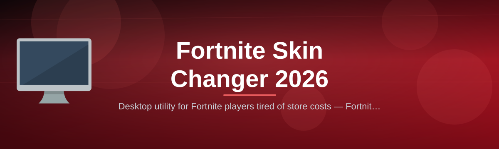

 

  
  
  

  

  
  
  

---

Desktop utility for Fortnite players tired of store costs — Fortnite Skin Changer 2026 previews, manages, and swaps local skin presets.

## Overview

Desktop utility for Fortnite players tired of store costs — Fortnite Skin Changer 2026 previews, manages, and swaps local skin presets.

  

## License

[MIT License](LICENSE)

  

